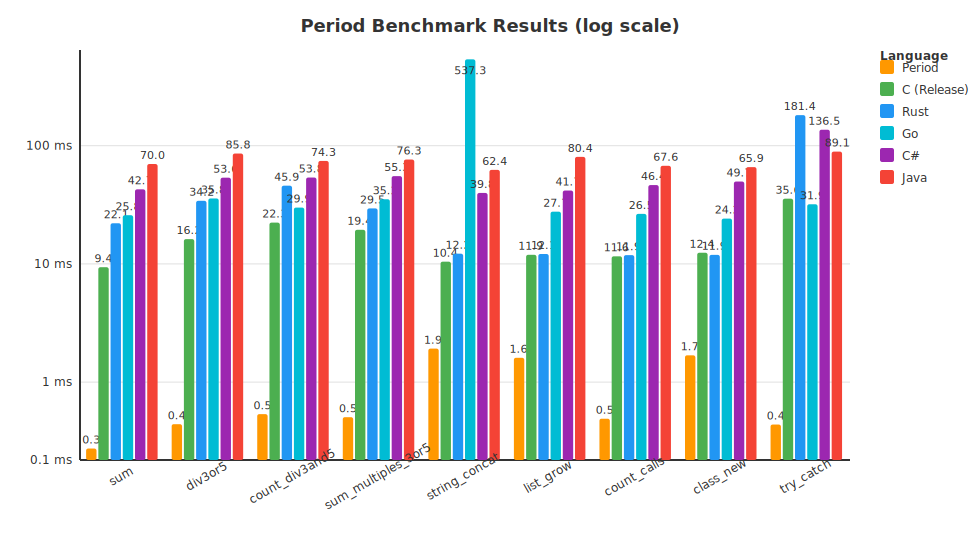

#  Period

An elegant English programming language where every statement ends with a period. It also accepts a familiar dot-and-parentheses compact syntax, so you can write `obj.method()` when `tell obj to method with ...` feels too verbose.

```period
-- Greet the world.
let greeting be "Hello, World!".
show greeting.
```

## Features

- Sentence-like syntax for readable code.
- Detailed error messages with exact line and column information.
- Turing complete: variables, conditionals, loops, functions, classes, and recursion.
- Modules and standard library: import built-in modules (math, string, random, time, list, text, path, test) or local `.period` files.
- VS Code extension with syntax highlighting, hover, completion, and LSP diagnostics.
- Command-line compiler and interactive REPL.

## Benchmark

Period is a bytecode compiler and virtual machine. The chart below shows a set
of numeric loop micro-benchmarks ([`docs/benchmark_long.py`](docs/benchmark_long.py)) where the
implementation recognizes specific shapes — such as `sum = 1 + 2 + ... + N` —
and evaluates them with closed-form arithmetic instead of iterating. On those
hand-picked workloads Period appears faster than C, Rust, Go, C# and Java, but
that is an apples-to-oranges comparison: the other languages are actually doing
the loop work, while Period is doing the math. It is not evidence that general
Period code outperforms those languages; for ordinary code it does not.



> [!NOTE]
> The standard library sort is a mergesort, not a closed-form trick. These
> optimizations apply only to the specific loop patterns exercised in
> `docs/benchmark_long.py`.

## Quick Start

Install with the Windows installer from the [releases page](https://github.com/period-lang/period/releases), then run:

```bash
period hello.period
```

Start the REPL:

```bash
period
```

```
Period REPL. Type 'exit.' or 'quit.' to leave, or Ctrl+C.

>>> let x be 10.
>>> show x * 2.
20
>>> exit.
```

## Building from Source

The language is implemented in Rust under `period/`. The release binary works on Windows, Linux, and macOS.

### Windows

```bash
cd period
cargo build --release
```

This produces `target/release/period.exe`. The full Windows distribution is built with:

```bash
python scripts/build_dist.py
```

### Linux / macOS

```bash
cd period
cargo build --release
```

The binary is at `target/release/period`. Copy or symlink it to your PATH:

```bash
sudo cp target/release/period /usr/local/bin/period
```

Run a program with:

```bash
period hello.period
```

## Language Notes

- **Truthiness is strict.** Only booleans can be used as conditions; strings, numbers, lists, and dictionaries are not implicitly truthy or falsy. Use explicit comparisons such as `if the length of xs > 0 then:` or `if name != "" then:`.
- **Type annotations are optional.** Unannotated code is checked dynamically; where annotations are given, the static type checker validates them before execution.
- **Function call arguments are full expressions.** `f with a + b` is parsed as `f(a + b)`, and `add with x + 1, y + 1` is parsed as `add(x + 1, y + 1)`. Parentheses are only needed to group expressions differently or to disambiguate nested calls.

## Standard Library Modules

Built-in modules can be imported directly by name:

```period
import list.
show sum with [1, 2, 3, 4].

import text.
show join with ["Hello", "World"], " ".
```

Available source modules include `list` (sum, max, min, length helpers) and `text` (join and other string utilities). Built-in native modules include `math`, `string`, `random`, and `time`.

## Package Manager

Period includes a small built-in package manager. Packages are resolved from a
hosted registry index and downloaded to a local `period_packages/` folder.

```bash
# Start a new project
period init myproject

# Install a package from the registry and add it to period.toml
period install hello

# Install a specific version
period install hello@1.2.3

# Install from a URL or local file (legacy direct install)
period install https://example.com/mypkg.period
period install ./mypkg.period

# Update all dependencies
period update
```

The default registry is hosted at `https://period-lang.github.io/registry`.
Set the `PERIOD_REGISTRY` environment variable to use a different registry root.

### Publishing a package

Packages are published by producing a registry entry for a `.period` file. The
entry can be merged into a local `registry.json` or printed to stdout:

```bash
period publish ./mypkg.period --name mypkg --version 1.0.0
```

To update an existing registry file:

```bash
period publish ./mypkg.period --name mypkg --version 1.0.0 --registry-file registry.json
```

The package file itself should be uploaded to a reachable URL (for example, a
GitHub Release asset). The registry entry's `url` points to that location.

Registry changes are submitted through the registry repository's normal
workflow (for example, a Pull Request against `period-lang/registry`). The old
`--push` flag that automatically ran `git add/commit/push` has been removed.

## Documentation

The full documentation is included in the `docs/` folder as a self-contained static website. Open `docs/index.html` in a browser after installation.

## License

MIT
